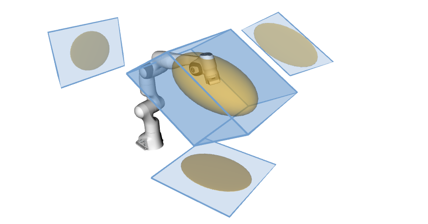
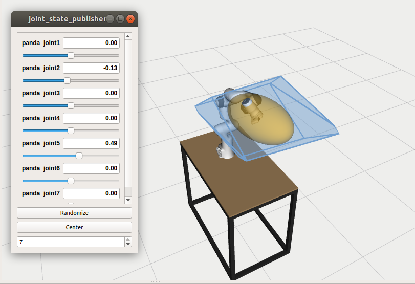
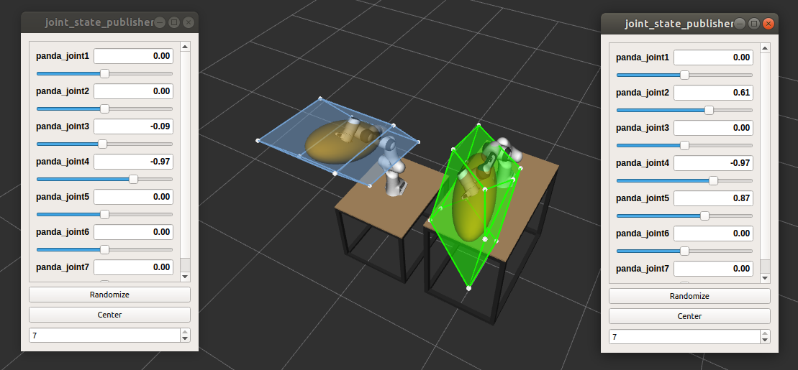
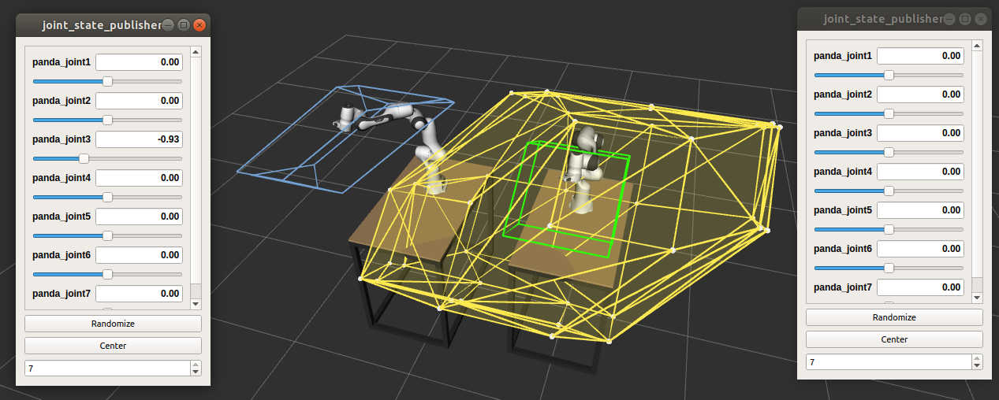
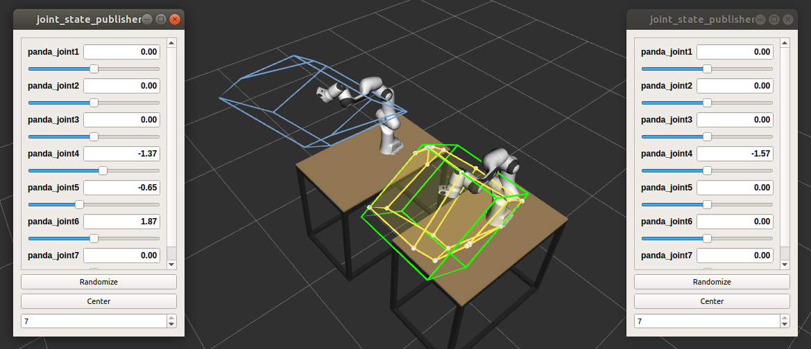

# On-line force capability evaluation based on efficient polytope vertex search

*by Antun Skuric, Vincent Padois, David Daney*<br>
*Published at ICRA2021*



New on-line polytope vertex search algorithm optimised for force and velocity polytope evaluation of serial robots.

This repository consists of 
- Paper
    - final pdf version of the paper
- [Matlab/octave implementation](#matlab-octave-testing-scripts)
    - full modular algorithm implementation
    - benchmarking comparison of three vertex search algorithms for *FRANKA Emika Panda* and *UR5* robot
- [Python module for calculating robot capacity](#python-capacity-module) `pycapacity`
    - force polytope
    - force/velocity manipulability ellipsoid
    - quick demo jupyter script
- [ROS packages and catkin workspace for *FRANKA Emika Panda* robot capacity calculation](#ros-panda-capacity-package-and-catkin)

<iframe src="https://player.vimeo.com/video/477650685?h=5e5708be9a" width="640" height="360" frameborder="0" allow="autoplay; fullscreen; picture-in-picture" allowfullscreen></iframe>
<p><a href="https://vimeo.com/477650685">On-line force capability evaluation based on efficient polytope vertex search  (submitted for presentation at ICRA 2021)</a> from <a href="https://vimeo.com/auctusinria">Auctus</a> on <a href="https://vimeo.com">Vimeo</a>.</p>


## Matlab / Octave testing scripts

In the `matlab_octave` directory you can find two testing scripts intended for benchmarking of vertex search algorithms
```matlab
panda_test_polytope_algorithms
``` 
and 
```
ur5_test_polytope_algorithms
```

They are both testing the performance of three vertex search algorithms on *Franka Emika Panda* robot and *UR5* robot:

> *On-line force capability evaluation based on efficient polytope vertex search <br> by Antun Skuric, Vincent Padois, David Daney*
```matlab
[f_vert, matrix_inverse_count] = polytope_auctus(Jacobian_mat,tau_min,tau_max);
```

> *Evaluation of Force Capabilities for Redundant manipulatiors <br> by
P.Chiacchio, Pierrot et al.*
```matlab
[f_vert, matrix_inverse_count] = polytope_pierrot(Jacobian_mat,tau_min,tau_max);
```

> *Vertex search algorithm of convex polyhedron representing upper limb manipulation ability  <br> by Sasaki et al.*
```matlab
[f_vert, matrix_inverse_count] = polytope_sasaki(Jacobian_mat,tau_min,tau_max);
```

## Python capacity module
The work described in the paper is fully implemented in python in the frame of the `pycapacity` pip package. This module you can easily integrate in your python project by isntalling it using `pip`
```shell
pip install pycapacity
```
The `pycapacity` module implements multiple task-space capacity metrics for robots and human musculoskeletal models. The robot metrics are contained in the `pycapacity.robot` module.
```python
import pycapacity.robot as capacity
```

### Module functions

- [`robot.acceleration_ellipsoid`](https://gitlab.inria.fr/auctus-team/people/antunskuric/pycapacity/-/blob/master/docs/robot.md#function-acceleration_ellipsoid): acceleration ellipsoid calculation (dynamic manipulability ellipsoid)
- [`robot.acceleration_polytope`](https://gitlab.inria.fr/auctus-team/people/antunskuric/pycapacity/-/blob/master/docs/robot.md#function-acceleration_polytope): Acceleration polytope calculating function
- [`robot.acceleration_polytope_withfaces`](https://gitlab.inria.fr/auctus-team/people/antunskuric/pycapacity/-/blob/master/docs/robot.md#function-acceleration_polytope_withfaces): Acceleration polytope calculating function
- [`robot.force_ellipsoid`](https://gitlab.inria.fr/auctus-team/people/antunskuric/pycapacity/-/blob/master/docs/robot.md#function-force_ellipsoid): force manipulability ellipsoid calculation
- [`robot.force_polytope`](https://gitlab.inria.fr/auctus-team/people/antunskuric/pycapacity/-/blob/master/docs/robot.md#function-force_polytope): Force polytope representing the capacities of the two robots in a certain configuration
- [`robot.force_polytope_intersection`](https://gitlab.inria.fr/auctus-team/people/antunskuric/pycapacity/-/blob/master/docs/robot.md#function-force_polytope_intersection): Force polytope representing the intersection of the capacities of the two robots in certain configurations.
- [`robot.force_polytope_intersection_withfaces`](https://gitlab.inria.fr/auctus-team/people/antunskuric/pycapacity/-/blob/master/docs/robot.md#function-force_polytope_intersection_withfaces): Force polytope representing the intersection of the capacities of the two robots in certain configurations.
- [`robot.force_polytope_sum_withfaces`](https://gitlab.inria.fr/auctus-team/people/antunskuric/pycapacity/-/blob/master/docs/robot.md#function-force_polytope_sum_withfaces): Force polytope representing the minkowski sum of the capacities of the two robots in certain configurations.
- [`robot.force_polytope_withfaces`](https://gitlab.inria.fr/auctus-team/people/antunskuric/pycapacity/-/blob/master/docs/robot.md#function-force_polytope_withfaces): Force polytope representing the capacities of the two robots in a certain configuration.
- [`robot.velocity_ellipsoid`](https://gitlab.inria.fr/auctus-team/people/antunskuric/pycapacity/-/blob/master/docs/robot.md#function-velocity_ellipsoid): velocity manipulability ellipsoid calculation
- [`robot.velocity_polytope`](https://gitlab.inria.fr/auctus-team/people/antunskuric/pycapacity/-/blob/master/docs/robot.md#function-velocity_polytope): Velocity polytope calculating function
- [`robot.velocity_polytope_withfaces`](https://gitlab.inria.fr/auctus-team/people/antunskuric/pycapacity/-/blob/master/docs/robot.md#function-velocity_polytope_withfaces): Velocity polytope calculating function, with faces
---

See [`demo_notebook.ipynb`](https://gitlab.inria.fr/auctus-team/people/antunskuric/pycapacity/-/blob/master/demo_notebook.ipynb) for one example use case of the module.

## ROS panda capacity package and catkin
In the `ROS_nodes` directory you can find the implementation of the python capacity module for a specific use case of Panda robot. The directory consists of two ros packages:
- hkl-kdl: a fork of  http://wiki.ros.org/hrl-kdl
- franka_description: Panda robot definitions from Franka Emika  http://wiki.ros.org/franka_description
- **panda_capacity: the capacity solver for Panda robot**

### Install the ros packages - using catkin
To run panda robot capacity calculation nodes first clone the repository and submodules:
```shell
git clone --recurse-submodules git@gitlab.inria.fr:askuric/polytope_vertex_search.git
```

`panda_capacity` package will calculate is an example implementation of the task space capacity calculation for for Franka Emika Panda robot in a form of a catkin ros package.

It uses the library KDL for reading the robot urdf ad it depends on 
- hrl-kdl package (https://gitlab.inria.fr/auctus-team/people/antunskuric/ros_nodes/hrl-kdl)
- franka_description package (https://gitlab.inria.fr/auctus/panda/torque-qp-extended/franka_description)

The three packages are shown in the `ROS/packages` folder. And you can find an example catkin workspace in the `ROS/catkin_ws` folder.

#### Create your won catkin workspace

Then create new catkin workspace:
```shell
mkdir ~/capacity_ws && cd ~/capacity_ws/
mkdir src && cd src
```
Then you can copy the folders from `ROS/packages` into the `capacity_ws/src` folder for example:
```shell
cp -r ~/polytope_vertex_search/ROS_packages/* .
```

Finally you can build the workspace
```shell
cd ..
catkin_make # catkin build
```
And you should be ready to go!


#### Dependancies
For visualizing the polytopes in RVIZ you will need to install the [jsk-rviz-plugin](https://github.com/jsk-ros-pkg/jsk_visualization)

```sh
sudo apt install ros-*-jsk-rviz-plugins # melodic/kinetic... your ros version
```

And you'll need to install the pip package `pycapacity`
```
pip install pycapacity
```

### One panda simulation
Once when you have everything installed you will be able to run the interactive simulations and see the polytope being visualised in real-time.



To see a simulation with one panda robot and its force and velocity manipulatibility ellipsoid and polytope run the command in the terminal.

```shell
source ~/capacity_ws/devel/setup.bash 
roslaunch panda_capacity one_panda.launch
```


### Two panda simulation

To demonstrate the collaborative robotics applications of our algorithm we have provided an interactive simulation of two panda robots where use can visualise their separate and joint force capacities. 



For the interactive simulation of two panda robots with their own capacity measures you can simply run the commands:
```shell
source ~/capacity_ws/devel/setup.bash 
roslaunch panda_capacity two_panda.launch
```

#### Minkowski sum of polytopes


Open a new terminal and run the command:
```shell
rosrun panda_capacity panda_force_polytope_sum.py
```

#### Intersection of polytopes


Open a new terminal and run the command:
```shell
rosrun panda_capacity panda_force_polytope_intersection.py
```
